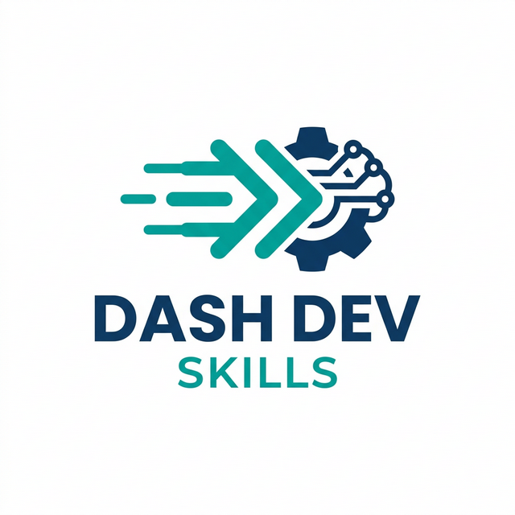

  

<h1 align="center">Dash Dev Skills</h1>

为 Dash 开发者提供的高级智能体（AI Agent）技能库，加速开发并避免 AI 幻觉 🚀

## 1 简介

收集并整理实用的 Prompt Skills，可在 Claude Code、OpenCode、Codex、Trae、Antigravity 等主流 AI 编程助手中无缝调用，专门优化 Dash 及 `feffery-antd-components` (fac) 的 AI 生成质量。

## 2 现有 skills

- **`dash-native-html-integration`**：规范嵌入原生 HTML/JS/CSS 等复杂定制化网页功能。
- **`fetch-fac-component-names`**：获取有效的 fac 组件名，避免 AI 编造不存在的组件。
- **`fetch-fac-component-props-doc`**：精准获取指定 fac 组件的官方参数文档，以供 AI 查阅。

## 3 安装方式

目标路径：`https://github.com/CNFeffery/dash-dev-skills` 下的 `skills` 目录。

- **手动放置**：克隆本仓库后，将需要的 `skills` 文件夹复制到你的智能体配置目录（如 `.claude/prompts`, `.agents/workflows` 等）。
- **AI 自动获取指令**：直接在对话框向 AI 发送以下 Prompt：
  > "请前往 `https://github.com/CNFeffery/dash-dev-skills` 仓库下的 `skills` 目录，将各个 skill 文件夹及其脚本获取并配置到当前项目中，以供你后续调用。"

## 4 更多应用开发教程

> 微信公众号「玩转 Dash」，欢迎扫码关注 👇

  

> 「玩转 Dash」知识星球，海量教程案例模板资源，专业的答疑咨询服务，欢迎扫码加入 👇

  

